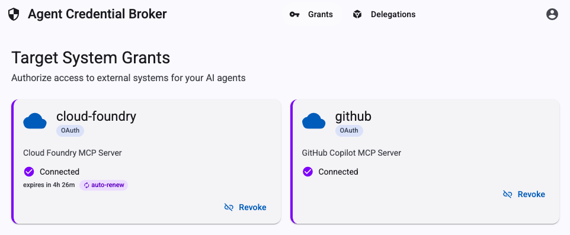

# Agent Credential Broker

A standalone Spring Boot + Angular service that centralizes credential management for AI agents. Instead of embedding secrets in agent applications, users pre-authorize the broker to hold credentials on their behalf, and agents exchange a signed delegation token for a short-lived credential at runtime.


## How It Works

1. **A user logs into the broker UI** and grants it access to each target system they want their agents to use — completing an OAuth consent flow, or pasting in a personal access token.

2. **The user creates a delegation token** — a signed JWT scoped to a specific agent, a subset of target systems, and a time window. This token is injected into the agent application (typically via `cf set-env` or `vars.yaml`).

3. **At runtime, the agent calls `POST /api/credentials/request`**, presenting its delegation token. The broker validates the delegation, checks the user's grant, and returns a ready-to-use credential.

Agents never handle user passwords or long-lived secrets. Users retain full visibility and control over which agents can access which systems.

> **New here?** See the [Getting Started Guide](docs/getting-started.md) for step-by-step setup and examples for all four credential types.

## Architecture

- **Spring Boot 3.5** backend with Spring Security OAuth2 (SSO login via Tanzu SSO / `p-identity`)
- **Angular 21** Material UI bundled into the jar via `frontend-maven-plugin`
- **Delegation tokens**: HMAC-SHA256 signed JWTs encoding user, agent, allowed systems, and expiry
- **Two-layer authorization**: Grants (per-user, per-system) + Delegations (per-user, per-agent, time-limited)
- **PostgreSQL** for persistent storage of grants and delegations

## Deployment

### Prerequisites

1. A `p-identity` service instance with the `uaa` plan (e.g., `agent-sso`)
2. A PostgreSQL service instance (e.g., `agent-db`)
3. A `vars.yaml` file with secrets (not checked into source control)

### Build and Push

```bash
mvn package
cf push --vars-file=vars.yaml
```

`mvn package` runs the full pipeline: installs Node.js, runs `npm ci` and `ng build`, compiles Java, copies Angular output into `static/`, and packages the fat jar.

### SSO Tile Configuration

After the first push, find **agent-credential-broker** in the SSO tile and configure:

- **Identity Providers**: Check "Internal User Store" (or whichever providers your users authenticate with)
- **Redirect URI Allowlist**: Add the app's base URL — the SSO tile supports partial URI matching, so this covers all callback paths:
  ```
  https://agent-credential-broker.apps.example.com
  ```
- **Scopes**: Add any scopes the broker needs to request on behalf of users. For the Cloud Foundry MCP server:
  - `cloud_controller.read`
  - `cloud_controller.write`

The broker uses the `p-identity` binding for two purposes: UI login (OAuth2 Login) and as the OAuth client for the Cloud Foundry target system. Both read `client_id` and `client_secret` directly from `VCAP_SERVICES` — no manual sync required. If you regenerate the App Secret in the SSO tile, run `cf push` and the updated credentials flow through automatically.

> **Do not** unbind and rebind the service — this deletes the existing client and creates a new one with a new App ID, invalidating the SSO tile configuration.

### Environment Variables

**Required:**

| Variable | Description |
|---|---|
| `BROKER_SIGNING_SECRET` | HMAC-SHA256 secret for signing delegation tokens |

**Required without a bound PostgreSQL service:**

| Variable | Default | Description |
|---|---|---|
| `DATABASE_URL` | `jdbc:postgresql://localhost:5432/broker` | PostgreSQL JDBC URL |
| `DATABASE_USERNAME` | `broker` | Database username |
| `DATABASE_PASSWORD` | `broker` | Database password |

When a PostgreSQL service is bound, these are typically injected automatically — verify with your platform team.

Additional variables depend on which target systems are configured. Each OAuth target system references its client credentials via `${...}` placeholders in `application.yml`. Systems using the SSO service binding read credentials from `VCAP_SERVICES` directly and require no additional variables.

### vars.yaml

```yaml
BROKER_SIGNING_SECRET: <random-base64-string>

# Database (if not injected via VCAP_SERVICES)
DATABASE_URL: jdbc:postgresql://<host>:5432/broker
DATABASE_USERNAME: broker
DATABASE_PASSWORD: <db-password>

# Target system credentials (add as needed)
GITHUB_OAUTH_CLIENT_ID: <from-github-oauth-app>
GITHUB_OAUTH_CLIENT_SECRET: <from-github-oauth-app>
```

### Target System Configuration

Target systems are declared in `src/main/resources/application.yml` under `broker.target-systems`. See the [Getting Started Guide](docs/getting-started.md) for the full field reference and examples of all four supported types (`OAUTH_AUTHORIZATION_CODE`, `OAUTH_CLIENT_CREDENTIALS`, `USER_PROVIDED_TOKEN`, `STATIC_API_KEY`).

## API

### Credential Access — called by agents

| Method | Path | Auth |
|---|---|---|
| `POST` | `/api/credentials/request` | Bearer delegation token |
| `GET` | `/api/credentials/status` | Bearer delegation token |

### Grant Management — authenticated UI

| Method | Path | Description |
|---|---|---|
| `GET` | `/api/grants` | List grants for current user |
| `POST` | `/api/grants/{system}/authorize` | Initiate OAuth flow |
| `POST` | `/api/grants/{system}/token` | Store user-provided token |
| `DELETE` | `/api/grants/{system}` | Revoke grant |

### Delegation Management — authenticated UI or inter-app

| Method | Path | Description |
|---|---|---|
| `POST` | `/api/delegations` | Create delegation token (SSO session) |
| `POST` | `/api/delegations/inter-app` | Create delegation token (UAA ID token) |
| `GET` | `/api/delegations` | List delegations |
| `DELETE` | `/api/delegations/{id}` | Revoke |
| `POST` | `/api/delegations/{id}/refresh` | Refresh with new expiry |

## Local Development

A local PostgreSQL instance is required. The defaults expect a database named `broker` with username `broker` and password `broker` on `localhost:5432`.

```bash
# Backend
mvn spring-boot:run

# Frontend (with proxy to backend at :4200 → :8080)
cd src/main/frontend
npm start
```

Override database defaults with environment variables:

```bash
export DATABASE_URL=jdbc:postgresql://localhost:5432/mydb
export DATABASE_USERNAME=myuser
export DATABASE_PASSWORD=mypassword
mvn spring-boot:run
```
