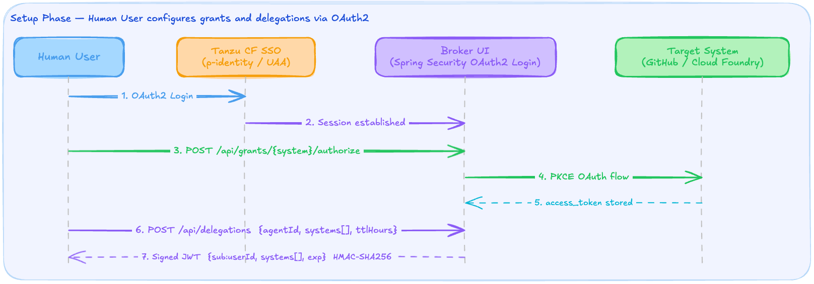
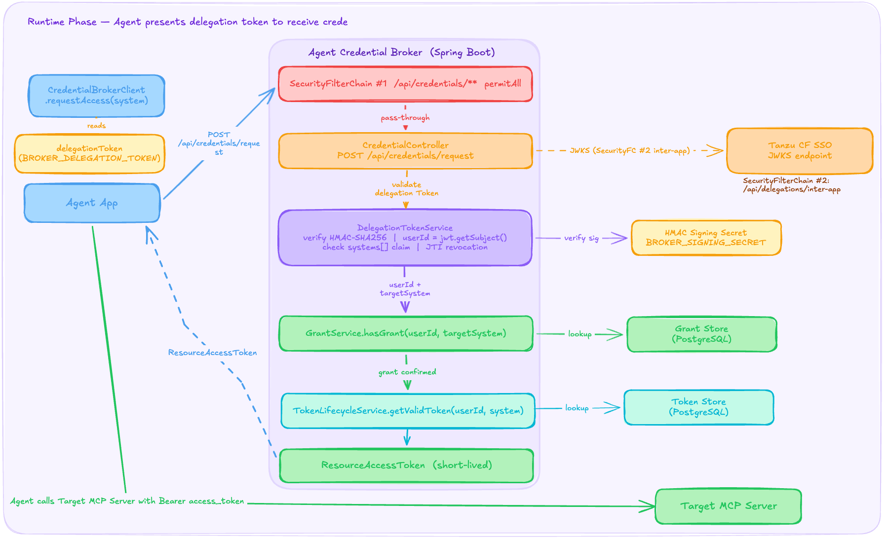

# Pre-Generated Delegation Token Workflow

This document describes the workflow where a human user creates a delegation token ahead of time and injects it into an agent application as an environment variable. At runtime, the agent uses this token to obtain credentials from the broker without any human interaction.

This is the recommended workflow for unattended agent applications — CI/CD pipelines, scheduled tasks, or long-running services — where no human is present at runtime to authorize credential access.

## Overview

The workflow has two phases:

1. **Setup** — A human user logs into the broker UI, grants access to target systems, and generates a delegation token scoped to a specific agent and set of systems.
2. **Runtime** — The agent application reads the delegation token from its environment and presents it to the broker's credential endpoint to receive short-lived access tokens.

---

## Setup Phase

In the setup phase, a human user prepares everything the agent will need at runtime. This is a one-time operation (repeated only when the delegation expires or the set of target systems changes).



### Step-by-step

1. **User authenticates** — The user logs into the broker UI via Tanzu SSO (p-identity / UAA). Spring Security establishes an HTTP session.

2. **Session established** — The broker UI is now accessible. The user can manage grants and delegations.

3. **User grants access to target systems** — For each system the agent needs (e.g. GitHub, Cloud Foundry), the user clicks "Connect" in the broker UI, which triggers `POST /api/grants/{system}/authorize`. For `USER_PROVIDED_TOKEN` systems, the user pastes their token directly.

4. **OAuth consent flow** — For `OAUTH_AUTHORIZATION_CODE` systems, the broker redirects the user to the target system's authorization server. The user completes the consent flow (PKCE-secured).

5. **Access token stored** — The broker receives the OAuth callback, exchanges the authorization code for tokens, and stores the access token (and refresh token, if provided) internally, keyed by `userId × targetSystem`.

6. **User creates a delegation** — The user navigates to the Delegations page and creates a new delegation by specifying:
   - **Agent ID** — a label identifying the agent application (e.g. `my-goose-app`)
   - **Allowed systems** — the subset of granted systems this agent may access
   - **TTL** — how long the delegation should remain valid (default: 72 hours, max: 720 hours)

   This sends `POST /api/delegations` with a body like:
   ```json
   {
     "agentId": "my-goose-app",
     "allowedSystems": ["github", "cloud-foundry"],
     "ttlHours": 168
   }
   ```

7. **Broker returns a signed JWT** — The broker creates an HMAC-SHA256 signed JWT containing:
   - `sub` — the user's ID
   - `agent` — the agent ID
   - `systems` — the list of allowed target systems
   - `exp` — the expiration timestamp (capped to the earliest non-refreshable token expiry if applicable)
   - `jti` — a unique delegation ID (e.g. `deleg-a1b2c3d4`)

   The user copies this token and injects it into the agent application's environment:
   ```bash
   cf set-env my-goose-app BROKER_DELEGATION_TOKEN <token>
   cf restage my-goose-app
   ```

---

## Runtime Phase

At runtime, the agent application uses the delegation token to request credentials. No human interaction is required.



### Step-by-step

1. **Agent reads delegation token** — On startup, the agent application reads `BROKER_DELEGATION_TOKEN` from its environment.

2. **Agent requests a credential** — When the agent needs to call a target system (e.g. a GitHub MCP server), it sends:
   ```
   POST /api/credentials/request
   Authorization: Bearer <delegation-token>
   Content-Type: application/json

   { "targetSystem": "github" }
   ```

3. **Security filter passes through** — The `/api/credentials/**` endpoint uses `SecurityFilterChain #1`, which is configured as `permitAll`. Authentication is handled inline by the controller, not by Spring Security filters.

4. **Delegation token validated** — `DelegationTokenService` verifies the JWT:
   - **Signature** — HMAC-SHA256 using `BROKER_SIGNING_SECRET` (falls back to `previous-signing-secret` for key rotation)
   - **Expiration** — the token must not be expired
   - **Revocation** — the token's `jti` is checked against the revoked JTI store

5. **System scope checked** — The controller verifies that the requested `targetSystem` appears in the JWT's `systems` claim.

6. **User ID extracted** — The `sub` claim provides the user ID. This is the identity under which the grant and stored tokens were created during setup.

7. **Grant verified** — `GrantService.hasGrant(userId, targetSystem)` confirms the user still has an active grant for this system.

8. **Token retrieved** — `TokenLifecycleService.getValidToken(userId, targetSystem)` looks up the stored access token. If the token is near expiry and a refresh token is available, it is refreshed automatically.

9. **Credential returned** — The broker responds with a `resource_access_token`:
   ```json
   {
     "type": "resource_access_token",
     "token": "gho_xxxxxxxxxxxx",
     "expiresAt": "2026-03-10T12:00:00Z",
     "headerName": "Authorization",
     "headerValue": "Bearer gho_xxxxxxxxxxxx"
   }
   ```

10. **Agent uses the credential** — The agent injects the `headerName` / `headerValue` pair into its outbound requests to the target MCP server.

### Error responses

| Condition | HTTP Status | Response |
|---|---|---|
| Missing `Authorization` header | 401 | `{"error": "Missing delegation token"}` |
| Invalid or expired JWT signature | 401 | `{"error": "Invalid delegation token"}` |
| Delegation has been revoked | 401 | `{"error": "Delegation token has been revoked"}` |
| Target system not in delegation scope | 403 | `{"error": "Target system not in delegation scope"}` |
| Unknown target system | 400 | `{"error": "Unknown target system: <name>"}` |
| User has no grant / stored token expired | 200 | `{"type": "user_delegation_required", "targetSystem": "...", "brokerAuthorizationUrl": "/grants"}` |

Note that a missing grant returns HTTP 200 with a `user_delegation_required` response type rather than an error status. This allows the agent to distinguish between authentication failures (which it cannot resolve) and missing grants (which a human can resolve by visiting the broker UI).

---

## Checking Credential Status

Agents can check which systems have active credentials without requesting a specific token:

```
GET /api/credentials/status
Authorization: Bearer <delegation-token>
```

Response:
```json
{
  "github": "connected",
  "cloud-foundry": "not_connected"
}
```

This is useful for startup health checks or presenting status information to users.

---

## Delegation Lifecycle

| Action | Endpoint | Description |
|---|---|---|
| Create | `POST /api/delegations` | Issue a new delegation token (SSO session required) |
| List | `GET /api/delegations` | View all delegations for the current user |
| Revoke | `DELETE /api/delegations/{id}` | Immediately invalidate a delegation |
| Refresh | `POST /api/delegations/{id}/refresh` | Revoke the old token and issue a new one with a fresh expiry |

Revoked delegations are rejected at runtime even if the JWT has not expired. The broker stores revoked JTIs until the original expiration time, then cleans them up automatically.

---

## Key Design Decisions

- **Agents never hold user credentials.** The delegation token only authorizes the agent to *request* credentials from the broker. The actual OAuth tokens remain in the broker's store.

- **Short-lived access tokens, long-lived delegation.** A delegation may last days or weeks, but the access tokens it unlocks are short-lived and refreshed automatically by the broker.

- **Expiry capping.** If a delegation covers a system whose stored token has no refresh token, the delegation's expiry is capped to that token's expiry — preventing the agent from holding a delegation that outlives the underlying credential.

- **Zero-downtime key rotation.** The broker accepts tokens signed with `previous-signing-secret` during rotation, so agents continue working while the signing key is being rolled.
