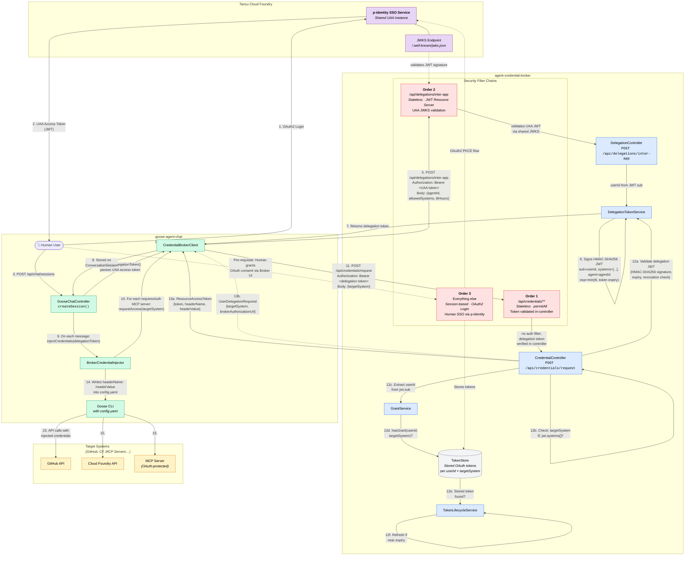

```mermaid
flowchart TB
    subgraph CF["Tanzu Cloud Foundry"]
        direction TB
        SSO["<b>p-identity SSO Service</b><br/><i>Shared UAA instance</i>"]
        JWKS["JWKS Endpoint<br/><i>/.well-known/jwks.json</i>"]
        SSO --- JWKS
    end

    subgraph AgentChat["goose-agent-chat<br/><i>(Agent Application)</i>"]
        direction TB
        User(["👤 Human User"])
        ChatCtrl["GooseChatController<br/><code>createSession()</code>"]
        BrokerClient["CredentialBrokerClient"]
        Injector["BrokerCredentialInjector"]
        GooseCLI["Goose CLI<br/><i>with config.yaml</i>"]

        User -->|"1. OAuth2 Login"| SSO
        SSO -->|"2. UAA Access Token<br/>(JWT)"| User
        User -->|"3. POST /api/chat/sessions"| ChatCtrl
        ChatCtrl -->|"4. obtainDelegationToken()<br/>passes UAA access token"| BrokerClient
    end

    subgraph Broker["agent-credential-broker"]
        direction TB

        subgraph SecurityLayers["Security Filter Chains"]
            direction LR
            Chain1["<b>Order 1</b><br/>/api/credentials/**<br/><i>Stateless · permitAll</i><br/>Token validated in-controller"]
            Chain2["<b>Order 2</b><br/>/api/delegations/inter-app<br/><i>Stateless · JWT Resource Server</i><br/>UAA JWKS validation"]
            Chain3["<b>Order 3</b><br/>Everything else<br/><i>Session-based · OAuth2 Login</i><br/>Human SSO via p-identity"]
        end

        DelegCtrl["DelegationController<br/><code>POST /api/delegations/inter-app</code>"]
        DelegSvc["DelegationTokenService"]
        CredCtrl["CredentialController<br/><code>POST /api/credentials/request</code>"]
        GrantSvc["GrantService"]
        TokenLC["TokenLifecycleService"]
        TokenStore[("TokenStore<br/><i>Stored OAuth tokens<br/>per userId × targetSystem</i>")]

        Chain2 -->|"validates UAA JWT<br/>via shared JWKS"| DelegCtrl
        DelegCtrl -->|"userId from JWT sub"| DelegSvc

        Chain1 -->|"no auth filter;<br/>delegation token<br/>verified in controller"| CredCtrl
    end

    subgraph TargetSystems["Target Systems<br/><i>(GitHub, CF, MCP Servers…)</i>"]
        GH["GitHub API"]
        CFAPI["Cloud Foundry API"]
        MCP["MCP Server<br/><i>(OAuth-protected)</i>"]
    end

    %% Delegation Token Creation Flow
    BrokerClient -->|"5. POST /api/delegations/inter-app<br/>Authorization: Bearer &lt;UAA token&gt;<br/>Body: {agentId, allowedSystems, ttlHours}"| Chain2
    JWKS -.->|"validates JWT signature"| Chain2
    DelegSvc -->|"6. Signs HMAC-SHA256 JWT<br/>sub=userId, systems=[...], agent=agentId<br/>exp=min(ttl, token expiry)"| DelegSvc
    DelegSvc -->|"7. Returns delegation token"| BrokerClient

    %% Credential Request Flow
    BrokerClient -->|"8. Stored on<br/>ConversationSession"| ChatCtrl
    ChatCtrl -->|"9. On each message:<br/>injectCredentials(delegationToken)"| Injector
    Injector -->|"10. For each requiresAuth MCP server:<br/>requestAccess(targetSystem)"| BrokerClient
    BrokerClient -->|"11. POST /api/credentials/request<br/>Authorization: Bearer &lt;delegation token&gt;<br/>Body: {targetSystem}"| Chain1

    CredCtrl -->|"12a. Validate delegation JWT<br/>(HMAC-SHA256 signature,<br/>expiry, revocation check)"| DelegSvc
    CredCtrl -->|"12b. Check: targetSystem<br/>∈ jwt.systems[]?"| CredCtrl
    CredCtrl -->|"12c. Extract userId<br/>from jwt.sub"| GrantSvc
    GrantSvc -->|"12d. hasGrant(userId,<br/>targetSystem)?"| TokenStore
    TokenStore -->|"12e. Stored token<br/>found?"| TokenLC
    TokenLC -->|"12f. Refresh if<br/>near expiry"| TokenLC

    %% Response paths
    CredCtrl -->|"13a. ResourceAccessToken<br/>{token, headerName, headerValue}"| BrokerClient
    CredCtrl -.->|"13b. UserDelegationRequired<br/>{targetSystem, brokerAuthorizationUrl}"| BrokerClient

    Injector -->|"14. Writes headerName: headerValue<br/>into config.yaml"| GooseCLI

    %% Target system access
    GooseCLI -->|"15. API calls with<br/>injected credentials"| GH
    GooseCLI -->|"15."| CFAPI
    GooseCLI -->|"15."| MCP

    %% Human grant flow (pre-requisite)
    User -.->|"Pre-requisite: Human grants<br/>OAuth consent via Broker UI"| Chain3
    Chain3 -.->|"OAuth2 PKCE flow"| SSO
    Chain3 -.->|"Stores tokens"| TokenStore

    %% Styling
    classDef sso fill:#e8d5f5,stroke:#7b2d8e,color:#000
    classDef broker fill:#dbeafe,stroke:#2563eb,color:#000
    classDef agent fill:#d1fae5,stroke:#059669,color:#000
    classDef target fill:#fef3c7,stroke:#d97706,color:#000
    classDef security fill:#fee2e2,stroke:#dc2626,color:#000
    classDef store fill:#f3f4f6,stroke:#6b7280,color:#000

    class SSO,JWKS sso
    class DelegCtrl,DelegSvc,CredCtrl,GrantSvc,TokenLC broker
    class ChatCtrl,BrokerClient,Injector,GooseCLI agent
    class GH,CFAPI,MCP target
    class Chain1,Chain2,Chain3 security
    class TokenStore store
```
